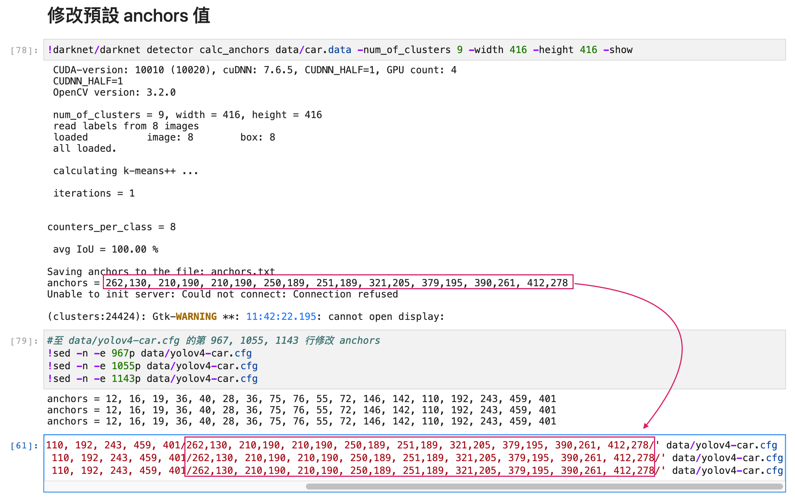

# YOLOv4

## 下載repo

```
git clone https://github.com/andy6804tw/yolov4-darknet.git
```

## Step 1: 編譯 darknet
我們透過 darknet 網路訓練一個 Yolo v4 物件偵測。darknet 是一個較為輕型的開源深度學習框架，其主要特點是基於 C 與 CUDA 並且容易安裝執行。執行 `build_darknet.ipynb` ，並遵循以下步驟後即可得到編譯好的 darknet。

- clone darknet
- 修改 Makefile
- 編譯 darknet

### 1-1 clone darknet
首先要先 git clone Darknet github:

```
git clone https://github.com/AlexeyAB/darknet
```

### 1-2 修改 Makefile
透過 `sed -i` 指令修改剛 clone 下來的 darknet 裡去修改 Makefile，將 GPU, CUDNN, CUDNN_HALF, OPENCV 修改為1。(預設值為0)

```
!sed -i "s/GPU=0/GPU=1/g" darknet/Makefile
!sed -i "s/CUDNN=0/CUDNN=1/g" darknet/Makefile
!sed -i "s/CUDNN_HALF=0/CUDNN_HALF=1/g" darknet/Makefile
!sed -i "s/OPENCV=0/OPENCV=1/g" darknet/Makefile
```

修改後可以看到 `darknet/Makefile` 中的 GPU, CUDNN, CUDNN_HALF, OPENCV 皆變為 1。

```
GPU=1
CUDNN=1
CUDNN_HALF=1
OPENCV=1
```

### 1-3 編譯 darknet
上述參數修改後，就可以開始編譯 darknet 網路。

```
!cd darknet; make
```

## Step 2: 訓練 car
開啟 `yolo_car.ipynb` 執行以下步驟：
- 準備訓練資料
- 轉換 voc 格式到 txt 格式
- 設定 cfg
- 修改預設 anchors 值
- 訓練模型
- 測試圖片

### 2-1 準備訓練資料
使用 `labelImg` 進行影像標註。

#### Windows/Linux 用戶
作者有提供已經編譯好的版本，可以到這裡[下載](https://tzutalin.github.io/labelImg/)。


#### macOS
開啟終端機輸入以下指令：

```
pip install labelimg
```

安裝完成後輸入以下指令即可打開視窗：

```
labelimg
```

#### 使用 labelImg 進行人工標註
打開要 label 的資料夾 `data/train` 和 `data/val`。選擇要存的格式有兩種，我們選擇 PascalVOC 格式。


標記完成後會產生對應的 xml 檔的 label 資訊，這樣就標記完畢。


### 2-2 轉換 voc 格式到 txt 格式
確認資料都已經標籤完畢後，開啟 `yolo_car.ipynb`，首先第一步我們要將剛剛標籤的所有 `xml` 檔案轉換成 `txt`。


### 2-3 設定 cfg
複製 `darknet/cfg/` 資料夾下的 `yolov4.cfg` 並使用指令修該以下參數。

```bash
!sed -i '2s/64/16/' data/yolov4-car.cfg # 修改 batch size
!sed -i '7s/608/416/' data/yolov4-car.cfg # 修改寬
!sed -i '8s/608/416/' data/yolov4-car.cfg # 修改高
!sed -i '17s/0.0013/0.000325/' data/yolov4-car.cfg # 修改 learning rate
!sed -i '19s/500500/6000/' data/yolov4-car.cfg # classes*2000 但是不能低於 6000
!sed -i '21s/400000,450000/4800,5400/' data/yolov4-car.cfg # 80% and 90% of max_batches
!sed -i '961s/255/18/' data/yolov4-car.cfg # (classes + 5)x3
!sed -i '968s/80/1/' data/yolov4-car.cfg
!sed -i '1049s/255/18/' data/yolov4-car.cfg # (classes + 5)x3
!sed -i '1056s/80/1/' data/yolov4-car.cfg
!sed -i '1137s/255/18/' data/yolov4-car.cfg # (classes + 5)x3
!sed -i '1144s/80/1/' data/yolov4-car.cfg
```

### 2-3 修改預設 anchors 值
使用 k-means 來生成 anchors，並修改 anchors 值。由於我們在 `yolov4.cfg` 中所設定的影像寬高為 416。可以使用以下指令自動算出 anchors 值。

```bash
!darknet/darknet detector calc_anchors data/car.data -num_of_clusters 9 -width 608 -height 608 -show
```

修改 967、1055、1143行的 anchors 更改上面所輸出的值。因為 num_of_clusters 設為9，因此會有9組值。



### 2-4 訓練模型
下載 yolov4 Darknet 官方事先訓練好的 weight (yolov4.conv.137)，放入 data 資料夾，就可以開始做訓練囉。(下載一次即可)

```bash
!cd data; wget https://github.com/AlexeyAB/darknet/releases/download/darknet_yolo_v3_optimal/yolov4.conv.137
```

權重下載完後即可開始訓練。如果要使用4顆GPU，輸入 0,1,2,3即可。建議在終端機上執行此指令：

```bash
darknet/darknet detector train data/car.data data/yolov4-car.cfg data/yolov4.conv.137 -dont_show -map -gpus 0,1,2,3
```

- 每 100 次迭代會生成 yolov4-car_last.weights
- 每 1000 次迭代會生成 yolov4-car_xxxx.weights 
- 若有給 val 資料的話會在第 1000 個 batch 時計算 mAP 並存下最好的 weights - yolov4-car_best.weights，之後每 100 次迭代都會計算 mAP
- 最後訓練完會生成 yolov4-car_final.weights 我們使用這個去預測
- 可以在 chart_yolov4-car.png 觀察到訓練歷史


### 2-5 測試圖片
等待訓練完後，就可以拿訓練好的 weight 來做預測。訓練好的 weights 會放在 weights 資料夾裡。首先我們先複製 `yolov4-car.cfg` 並改名為 `yolov4-car-test.cfg`。並將 `batch_size` 與 `subdivision` 設為1。

```
!cp data/yolov4-car.cfg data/yolov4-car-test.cfg
!sed -i '2s/16/1/' data/yolov4-car-test.cfg # batch_size 設為 1
!sed -i '3s/8/1/' data/yolov4-car-test.cfg # subdivision 設為 1
```

我們挑選最後訓練完成的模型 `yolov4-car_final.weights` 並使用鋼索建立好的設定檔 `yolov4-car-test.cfg` 為 `test.jpg` 進行物件偵測。

```bash
darknet/darknet detector test data/car.data data/yolov4-car-test.cfg weights/yolov4-car_final.weights test.jpg
```


